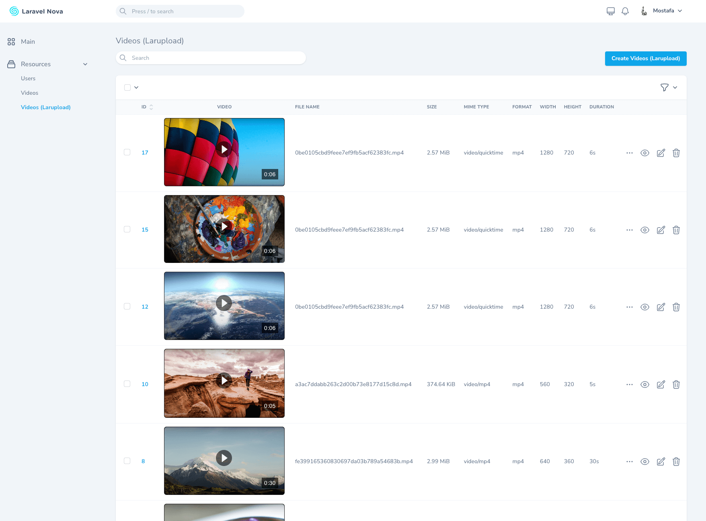
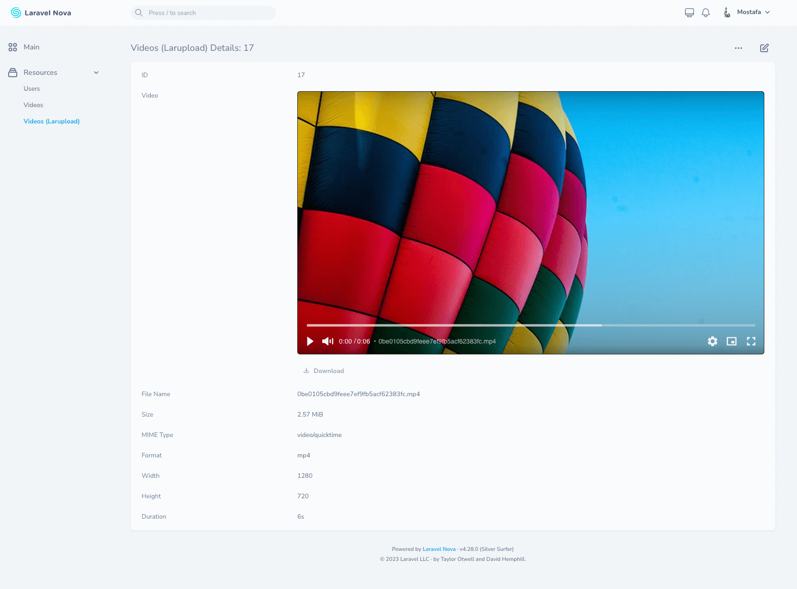
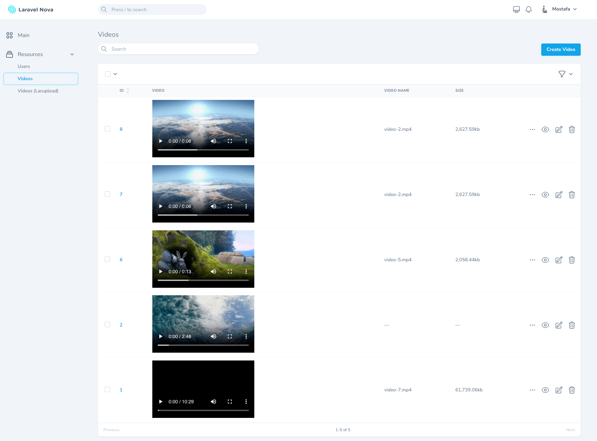
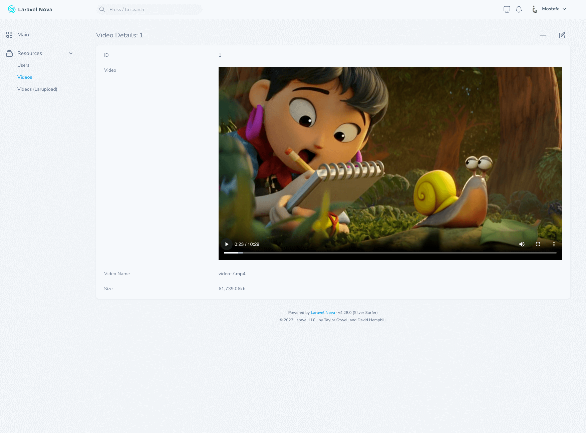

# Demo

<figure><figcaption>
Index (Larupload)
</figcaption></figure>

 

<figure><figcaption>
Detail (Larupload - With Metadata)
</figcaption></figure>

 

<figure><figcaption>
Edit (Larupload - With Cover Uploader)
</figcaption></figure>

 

<figure><figcaption>
Index
</figcaption></figure>

 

<figure><figcaption>
Detail
</figcaption></figure>

 

<figure><figcaption>
Delete a Video
</figcaption></figure>


